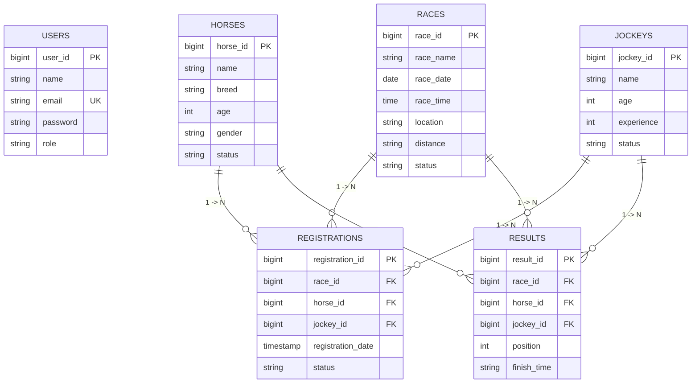

# Database Design & Normalization Analysis

## Database Technology
- **DBMS**: MySQL 8.0+
- **Database Name**: `horserace_db`
- **Engine**: InnoDB (Transaction-safe, Foreign Key Support)
- **Character Set**: UTF-8 (`utf8mb4`)

---

## Relational Entity-Relationship (ER) Model



---

## Database Normalization Justification

### First Normal Form (1NF)
- All columns contain atomic (indivisible) scalar values.
- No repeating groups or arrays stored in any row.
- Every table has a clearly defined Primary Key (`user_id`, `horse_id`, `jockey_id`, `race_id`, `registration_id`, `result_id`).

### Second Normal Form (2NF)
- Satisfies 1NF.
- Every non-key attribute is fully functionally dependent on the entire Primary Key.
- No partial dependencies exist. Associative table attributes (`registration_date`, `finish_time`) depend on the full registration or result key.

### Third Normal Form (3NF)
- Satisfies 2NF.
- No transitive dependencies exist. Attributes like `horse_name` or `race_name` are NOT duplicated in `registrations` or `results`.
- Information about horses is isolated strictly within `horses`, and information about races is isolated strictly within `races`. Foreign keys (`race_id`, `horse_id`, `jockey_id`) form relationship pointers.

---

## SQL JOIN Demonstrations

### Query 1: Fetch Scheduled Races with Participating Horses and Assigned Jockeys (3-Table JOIN)
```sql
SELECT 
    r.race_name,
    r.race_date,
    r.location,
    h.name AS horse_name,
    h.breed AS horse_breed,
    j.name AS jockey_name
FROM registrations reg
JOIN races r ON reg.race_id = r.race_id
JOIN horses h ON reg.horse_id = h.horse_id
JOIN jockeys j ON reg.jockey_id = j.jockey_id
WHERE r.status = 'SCHEDULED'
ORDER BY r.race_date ASC;
```

### Query 2: Fetch Official Race Finish Results (4-Table JOIN with Ordering)
```sql
SELECT 
    r.race_name,
    res.position,
    h.name AS horse_name,
    j.name AS jockey_name,
    res.finish_time
FROM results res
JOIN races r ON res.race_id = r.race_id
JOIN horses h ON res.horse_id = h.horse_id
JOIN jockeys j ON res.jockey_id = j.jockey_id
WHERE r.race_id = 1
ORDER BY res.position ASC;
```
